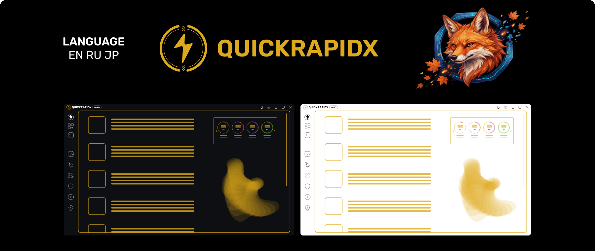

<div align="center">


<br>

**Один органайзер для Windows: программы, наборы, изоляция и уборка в системе.**

<br>

<a href="https://github.com/Good4Fox/QuickRapidX/releases/latest"></a>
<a href="https://github.com/Good4Fox/QuickRapidX/releases"></a>
<a href="../LICENSE"></a>
<a href="https://boosty.to/good-fox"></a>
<a href="https://www.patreon.com/Good4Fox"></a>

<br><br>


<br>



<br>

**Русский** · [English](#english) · [日本語](#日本語)

</div>

---

## Что это

Утилита для тех, у кого на машине не десять программ, а полторы сотни, и кто хотя бы
раз переустанавливал Windows и собирал всё обратно по памяти.

QuickRapidX держит программы в порядке, запускает их так, как удобно вам, и правит те
настройки системы, до которых обычно добираются через реестр и пять вложенных окон.

Программа в активной разработке. Ниже честно разделено: что работает в нынешней сборке,
а что ещё впереди.

---

## Работает сейчас

### Наборы

Соберите программы, папки и ссылки в один список и открывайте его значком в трее или
ярлыком с рабочего стола. Окно набора вырастает от того края экрана, где стоит панель
задач, и закрывается само, стоит увести взгляд.

- наборы вкладываются друг в друга, как папки;
- у каждой записи свой значок, подпись и всплывающая подсказка;
- порядок меняется перетаскиванием, раскладка — строкой или столбцом, у каждого набора своя;
- запись можно вытащить из окна прямо на панель задач или в проводник;
- «Запустить всё» поднимает набор целиком, по одному нажатию.

### Найденное на машине

Осмотр идёт по четырём источникам сразу, и каждый находит своё:

| Источник | Что находит |
| --- | --- |
| Реестр удаления | то, что поставил установщик |
| Пакеты Store | приложения из Microsoft Store |
| Средства из `PATH` | инструменты разработки, о которых не знает панель управления |
| Обход дисков | портативные программы, за которыми нет ни одной записи об установке |

Дальше — поиск, отбор по роду, запуск и переход в папку. Кнопка запуска выбирает
настоящий исполняемый файл, а не деинсталлятор и не значок: имя сверяется с названием
программы, а служебные файлы отсеиваются по признакам.

### Хранилище

Объявите папку **Местом** — и складывайте туда установщики и портативные сборки. Место
можно перенести на другой диск целиком, вместе с содержимым, или унести на съёмном
носителе и подключить на другой машине.

### Изоляция · пробная возможность

Запуск программы с урезанными правами: свой профиль, своя папка данных, свои разрешения.

- **своя среда** — на AppContainer, ставить ничего не нужно;
- **песочница Windows** — если компонент включён, а если нет, программа его поставит;
- **Sandboxie** — если он уже есть в системе.

Права выбираются ролью — браузер, общение, просмотр, игра, — или по одному: сеть,
папки, съёмные носители. Со средой можно снять **снимок** перед сомнительной установкой
и откатиться к нему, а снимок — вынести на другую машину.

> Изоляция сужает то, до чего программа дотянется. Это удобство, а не граница
> безопасности: программу, которая сама пытается вырваться, она не удержит. И приложения
> из Microsoft Store не запускаются ни одним способом — там не программы, а точки
> перенаправления.

### Корзина

Отдельный значок в трее — с пятью ступенями наполнения и своими картинками под каждую.

- предел размера задаётся **по каждому диску**: долей от его объёма или своим числом;
- переключатели подтверждения, звука и окна хода — родные, те же, что у оболочки;
- нажатие по значку настраивается: открыть или очистить;
- подсказка показывает, сколько занято и сколько лежит.

### Восстановление Windows

- проверка и починка хранилища компонентов через DISM — быстрая и полная;
- переустановка песочницы Windows, когда она отказывается подниматься;
- удаление `Windows.old` — вместе с тем, что обычному удалению не поддаётся: программа
  забирает владение файлами и переписывает разрешения.

Ни одна задача не открывает чёрное окно консоли: ход виден в самой программе.

### Каталог

Своя запись о программе: название, ссылка, идентификатор winget, значок и описание,
разложенные по ролям — приложения, игры, лаунчеры, разработка, ИИ.

### Мелочи, которые заметны

- **Три языка** — русский, английский, японский. При первом запуске язык берётся из системы.
- **Две темы** — тёмная и светлая, каждая своя, а не вывернутая наизнанку.
- **Панель трея** — корзина, наборы, сведения о машине и питание, не открывая окна.
- **Крестик прячет в трей**, а удержание закрывает совсем.
- **Спящие окна** — скрытое окно усыпляется, а не висит в памяти.

---

## Впереди

`Автоматизация` · `Информация о системе` · `Очистка` · `Реестр` ·
`Защита от вирусов` · `Статистика дисков` · `Управление подсветкой`

Разделы уже стоят в меню и помечены как незаконченные — чтобы было видно, куда движется
программа.

---

## Установка

Возьмите установщик из [последнего релиза](https://github.com/Good4Fox/QuickRapidX/releases/latest):
`.msi` или `.exe`, что привычнее. Нужен Windows 10 или 11.

### Сборка из исходников

```bash
bun install
bun run tauri dev      # разработка
bun run tauri build    # релизная сборка
bun run check          # проверка типов
```

Понадобятся [Bun](https://bun.sh), [Rust](https://rustup.rs) и
[всё, что требует Tauri](https://tauri.app/start/prerequisites/). Подробности об
устройстве окон, команд и ядра — в [docs/ARCHITECTURE.md](../docs/ARCHITECTURE.md).

---

## На чём сделано

**Tauri 2** · **SvelteKit 2** · **Svelte 5** (руны) · **TypeScript** · **Rust** · **bun**

Три окна — главное, панель трея и окно набора, — каждое со своим маршрутом. Ядро на Rust
говорит с оболочкой Windows напрямую: реестр, `AppContainer`, `SHEmptyRecycleBin`,
извлечение значков, права на файлы. Значки хранятся одним файлом-хранилищем и уходят в
интерфейс своей схемой uri, а не картинкой в разметке.

---

<details>
<summary><b>English</b></summary>

<br>

**QuickRapidX — one organizer for Windows: programs, sets, isolation and system cleanup.**

A utility for people whose machine holds a hundred and fifty programs rather than ten, and
who have reinstalled Windows at least once and put everything back from memory.

### Works today

- **Sets** — programs, folders and links gathered into one list, opened from a tray icon
  or a desktop shortcut. Sets nest inside each other, carry their own icons and captions,
  reorder by dragging, and lay out as a row or a column per set. An entry can be dragged
  straight out onto the taskbar.
- **Found on this machine** — a sweep across four sources at once: the uninstall registry,
  Store packages, developer tools on `PATH`, and portable programs no installer ever
  recorded. The launch button picks the real executable, not an uninstaller or an icon.
- **Storage** — a folder declared as a Place, holding installers and portable builds. It
  can be moved to another drive whole, or carried away on removable media.
- **Isolation** *(experimental)* — running a program with cut-down rights across three
  engines: a built-in one on AppContainer, Windows Sandbox, and Sandboxie. Permissions by
  role or one by one, plus snapshots of the data folder you can roll back to.
  *It narrows what a program can reach; it is not a security boundary.*
- **Recycle Bin** — a separate tray icon with five fill levels and custom icons per level,
  size limits set per drive as a share of the disk or a value of your own, and the shell's
  own confirmation, sound and progress switches.
- **Recovery** — component store checks and repair through DISM, Windows Sandbox
  reinstall, and removal of `Windows.old` including the parts ordinary deletion refuses to
  touch. No task opens a console window — progress is shown inside the app.
- **Catalog** — your own record of a program: name, link, winget id, icon and description.
- Three languages, two themes, a tray panel, close-to-tray, and hidden windows put to
  sleep rather than kept in memory.

### Ahead

`Automation` · `System Info` · `Cleaning Tools` · `Registry Manager` ·
`Virus Shield` · `Disk Stats` · `RGB Control`

### Install

Grab the installer from the [latest release](https://github.com/Good4Fox/QuickRapidX/releases/latest) —
`.msi` or `.exe`. Windows 10 or 11 required.

</details>

<details>
<summary><b>日本語</b></summary>

<br>

**QuickRapidX — Windows のためのオーガナイザー。プログラム、セット、分離実行、システムの整理。**

インストール済みのプログラムが十個ではなく百五十個あり、Windows を入れ直して記憶を頼りに
すべて戻した経験のある方のためのユーティリティです。

### 現在動くもの

- **セット** — プログラム・フォルダー・リンクを一つのリストにまとめ、トレイアイコンや
  ショートカットから開けます。入れ子にでき、独自のアイコンと名前を持ち、ドラッグで並べ替え、
  セットごとに横一列にも縦一列にもできます。項目をタスクバーへ直接ドラッグすることも可能です。
- **この PC で検出** — 四つの情報源を一度に走査します。アンインストール情報、Store パッケージ、
  `PATH` 上の開発ツール、記録の残らないポータブルプログラム。起動ボタンはアンインストーラーや
  アイコンではなく、本来の実行ファイルを選びます。
- **保管場所** — フォルダーを保管場所として登録し、インストーラーやポータブル版を置いておけます。
  別のドライブへ丸ごと移動でき、リムーバブルメディアで持ち出せます。
- **分離実行**（試験的） — 権限を絞ってプログラムを実行します。方式は三つ — AppContainer に
  よる内蔵の環境、Windows サンドボックス、Sandboxie。役割ごと、あるいは個別の権限設定と、
  戻せるスナップショット。*到達範囲を狭めるものであり、セキュリティ境界ではありません。*
- **ごみ箱** — 五段階の残量を示す専用トレイアイコン、段階ごとの独自アイコン、ドライブごとの
  上限（ディスクの割合または任意の値）、確認・音・進行状況というシェル本来の設定。
- **回復** — DISM によるコンポーネントストアの確認と修復、Windows サンドボックスの入れ直し、
  通常の削除では消せない部分を含む `Windows.old` の削除。コンソールは一切開きません。
- **カタログ** — プログラムの自分用の記録：名前、リンク、winget の ID、アイコン、説明。
- 三言語、二つのテーマ、トレイパネル、閉じるボタンでトレイへ、そして隠れたウィンドウは
  メモリに残さず休止させます。

### これから

`自動化` · `システム情報` · `クリーニング` · `レジストリ` ·
`ウイルス対策` · `ディスク統計` · `RGB 制御`

### インストール

[最新のリリース](https://github.com/Good4Fox/QuickRapidX/releases/latest) から `.msi` または
`.exe` を入手してください。Windows 10 または 11 が必要です。

</details>

---

<div align="center">

[Журнал изменений](CHANGELOG.md) · [Участие в разработке](CONTRIBUTING.md) ·
[Безопасность](../SECURITY.md) · [Правила общения](CODE_OF_CONDUCT.md)

<br>

Нравится — поддержите: [Boosty](https://boosty.to/good-fox) · [Patreon](https://www.patreon.com/Good4Fox)

<sub>MIT · © 2024 — настоящее время, QuickRapidX</sub>

</div>
